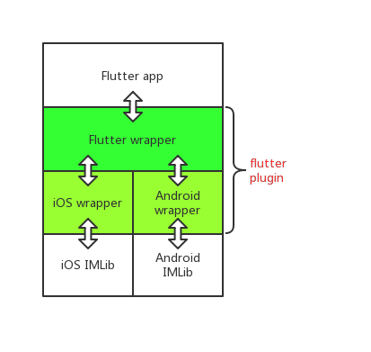

# 融云 IM flutter plugin

本文档讲解如何二次开发 IM flutter plugin

[Flutter 官网](https://flutter.dev/)

#整体架构




#目录结构

`android/`:Android wrapper

`ios/`：iOS wrapper 

`lib/`：Flutter wrapper

`example/`：demo

`example/android/`：Android project

`example/ios/`：iOS project

`example/lib/`：Flutter app

#原理

Futter 通过 `MethodChannel` 实现与 native 的交互，可以详细[参见官网介绍](https://flutter.dev/docs/development/platform-integration/platform-channels)

`调用任何接口，Flutter 都会把 methodname 和 arguments 传递出去，native 需要根据 methodname 知道 Flutter 的操作，然后根据具体的 arguments 处理，反之 native 调用 flutter 也是如此`

`想要了解如何调用的，可以自行在 native 平台 debug`


# Flutter wrapper

Flutter wrapper 目前所有的接口封装在 `rong_im_plugin.dart` 中，可以按需增加新的接口

首先 flutter 通过一个特定的 string 获取一个 methodchannel

```
static final MethodChannel _channel = const MethodChannel('rongcloud_im_plugin')
```

所有接口全部通过该 methodchannel 进行与 native 的交互


已有的接口

`init`:初始化 SDK，对应 native 的 initWithAppkey

`connet`:连接 IM ，对应 native 的 connectWithToken，因为连接是需要等异步回调的，所以 Flutter 层的写法是方法后面跟 async ，然后通过 await 来接收 native 层返回的结果


以上各方法都可以在 `example/lib/` 的相关代码找到


# iOS wrapper

与 Flutter 交互在 `RongcloudImPlugin.m` 中

iOS 通过一个特定的 string 获取一个 methodchannel，保证此处的 string 和 Flutter 的 methodchannel 一致

```
FlutterMethodChannel* channel = [FlutterMethodChannel
      methodChannelWithName:@"rongcloud_im_plugin"
            binaryMessenger:[registrar messenger]];
```

所有 Flutter 的接口都会通过下面接口的参数 call 获取到 methodname 和 arguments

```
- (void)handleMethodCall:(FlutterMethodCall*)call result:(FlutterResult)result
```

所有对 Flutter 的响应都在 `RCIMFlutterWrapper.m` 中处理

## iOS wrapper 如何依赖 IMLib

在 `./ios` 目录 iOS wrapper 会自动生成一个 `podspec` 文件

里面内容与标准的 podspec 一致，默认只会依赖 Flutter，只需要加上 `s.dependency 'RongCloudIM/IMLib'` 即可依赖 IMLib


# Android wrapper

与 Flutter 交互在 `RongcloudImPlugin.java` 中

Android 通过一个特定的 string 获取一个 methodchannel，保证此处的 string 和 Flutter & iOS 的 methodchannel 一致

```
final MethodChannel channel = new MethodChannel(registrar.messenger(), "rongcloud_im_plugin")
```

所有 Flutter 的接口都会通过下面接口的参数 call 获取到 methodname 和 arguments

```
public void onMethodCall(MethodCall call, Result result) 
```

所有对 Flutter 的响应都在 `RCIMFlutterWrapper.java` 中处理

## Android wrapper 如何依赖 IMLib

Android wrapper 所在目录会自动生成一个 `build.gradle` 文件

里面内容与标准的 build.gradle 一致，需要加上 

```
rootProject.allprojects {
    repositories {
        google()
        jcenter()
        mavenCentral()
        maven {url  "https://dl.bintray.com/rongcloud/maven"}
    }
}

dependencies {
    api 'cn.rongcloud.sdk:im_lib:2.9.19'
    implementation 'com.android.support:appcompat-v7:26.0.0'
}
```

即可依赖 IMLib


# 问题

## Flutter wrapper 接口调用顺序是怎样的？

1：调用 `init`

2：调用 `connect`

3：其余接口按需调用


## Flutter 依赖 native SDK 各个版本是怎样的？

iOS 依赖的是 pod 管理的 IMLib ，在 `./ios` 目录的 `podspec` 文件没有指定版本，默认是最新版本

Android 依赖的 maven 管理的 IMLib，在 `./android` 目录的 `build.gradle` 文件中指明了具体版本


## Flutter & iOS & Android 的核心代码都在哪儿？

`Flutter wrapper`：`rong_im_plugin.dart`

`iOS wrapper`：`RCIMFlutterWrapper.m`

`Android wrapper`：`RCIMFlutterWrapper.java`